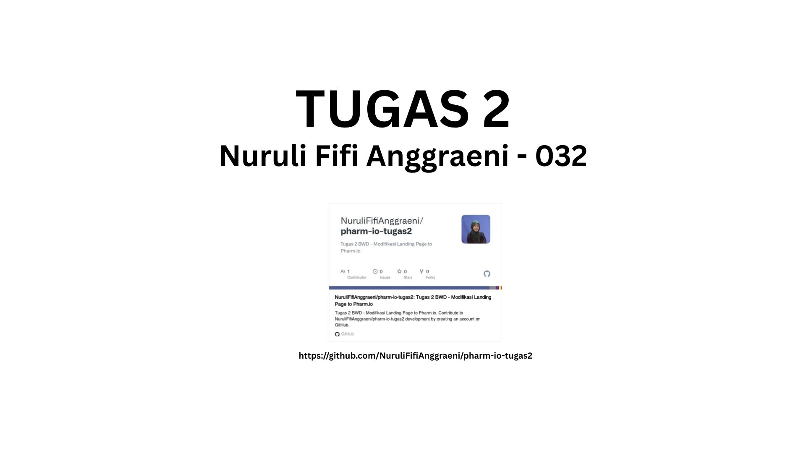
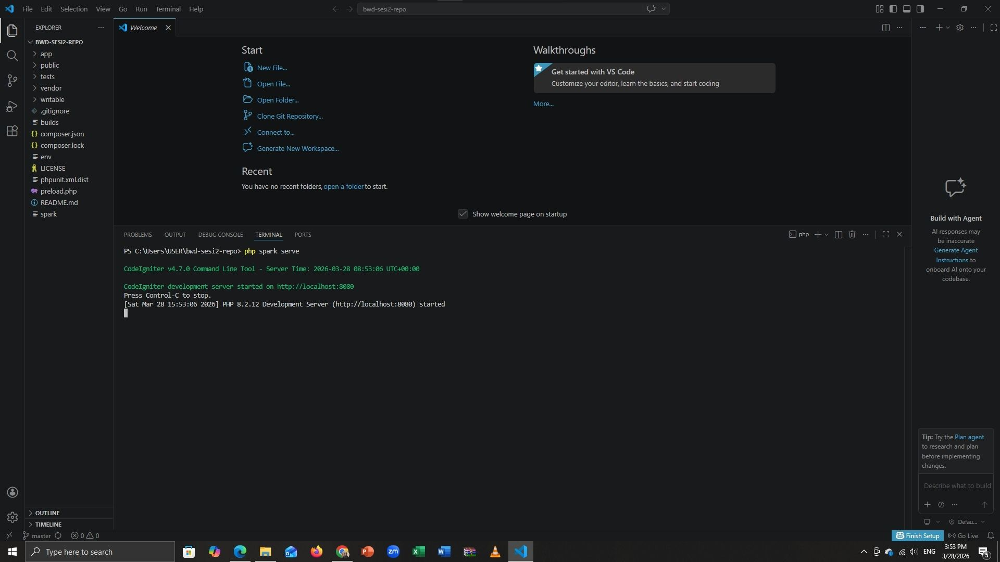
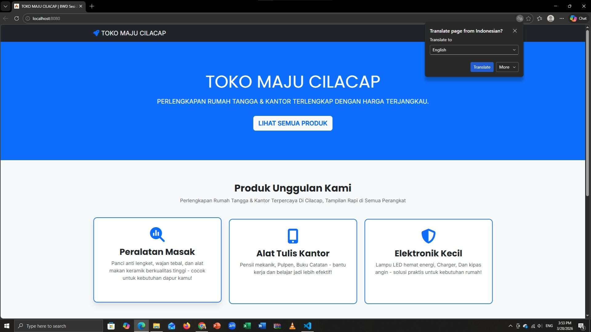
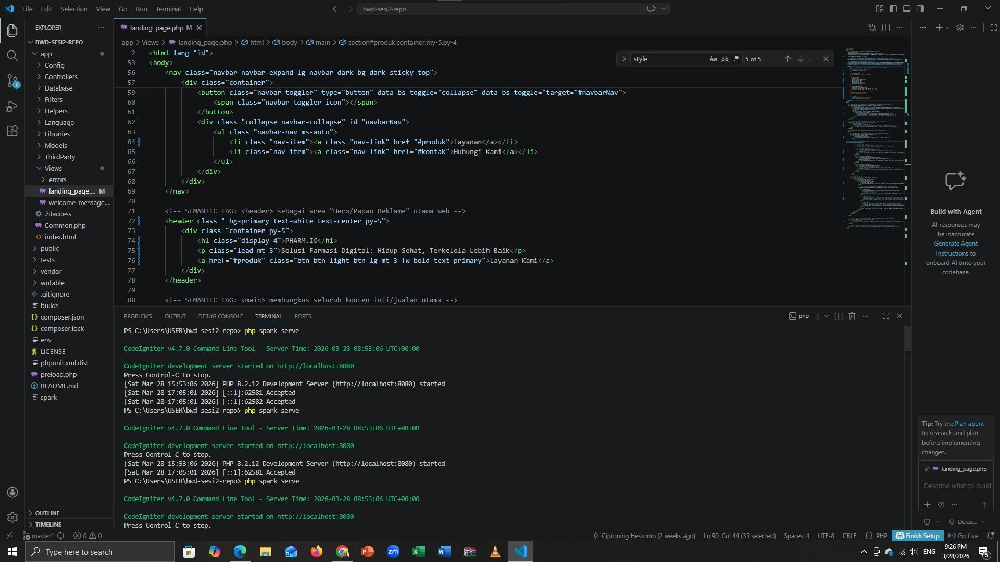
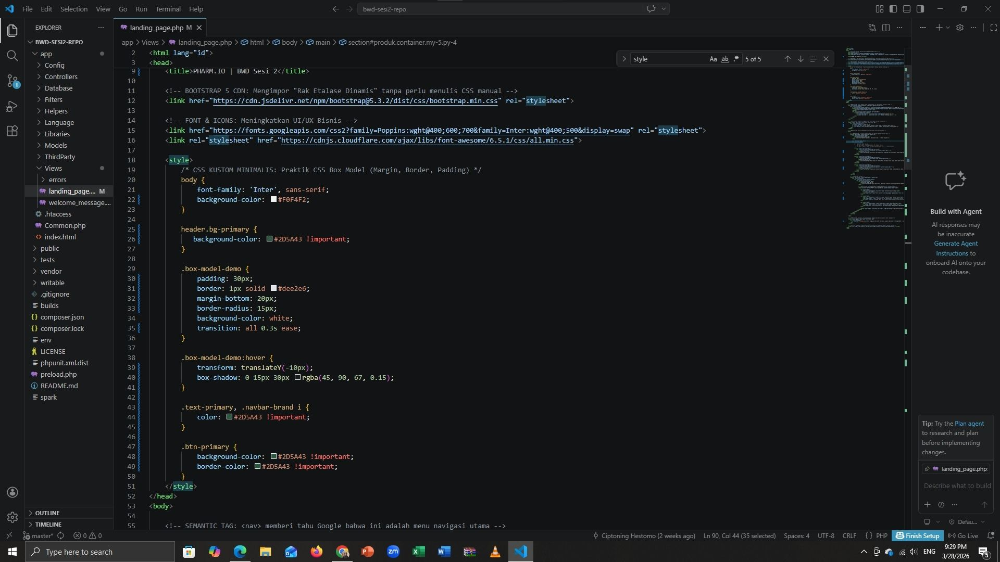
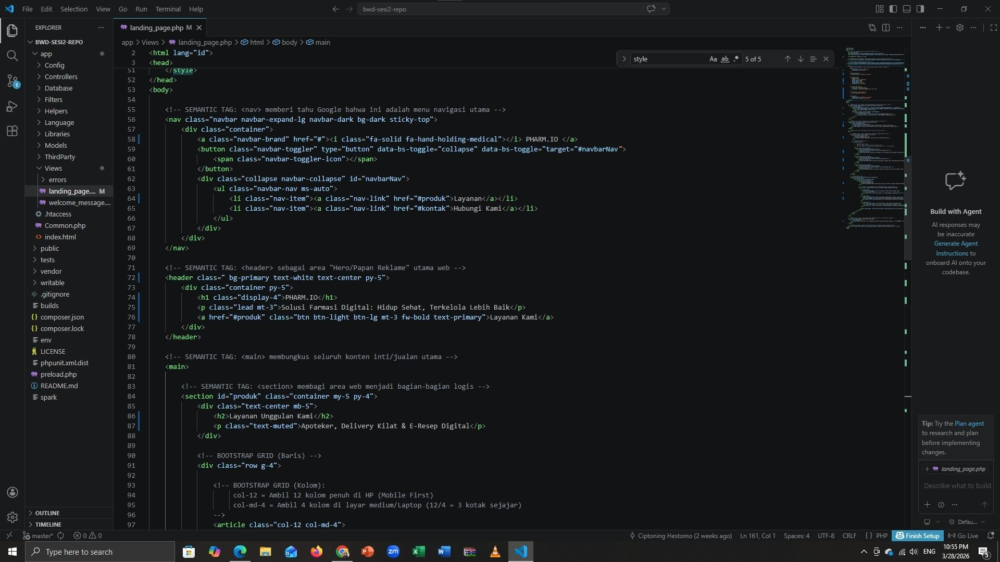
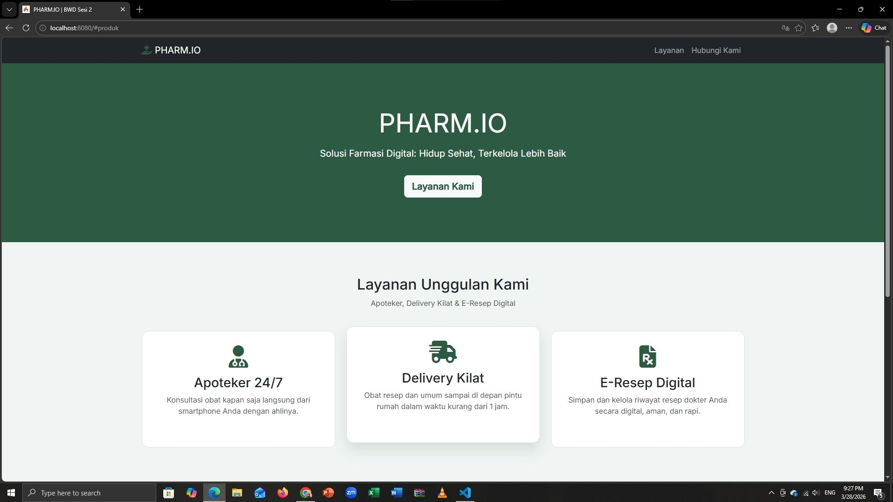
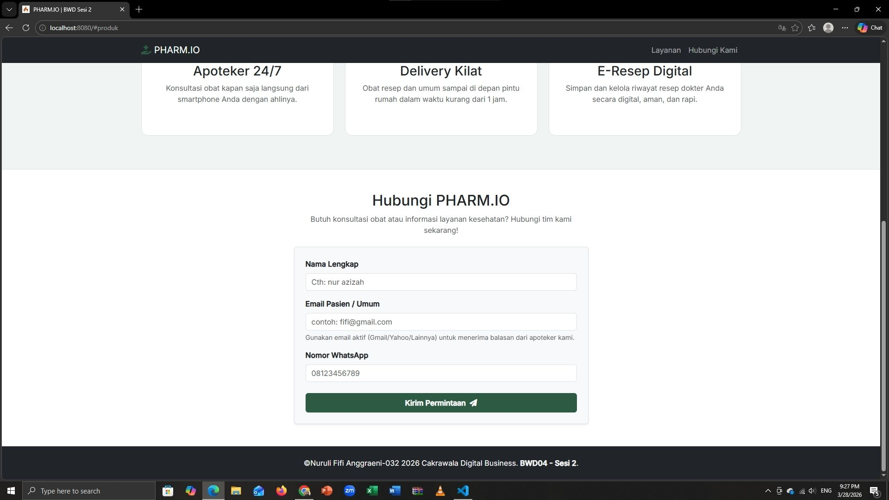

# 💊 PHARM.IO - Digital Pharmacy Solutions
**Tugas 2: Pemrograman Web (BWD Sesi 2)**

### 📋 Deskripsi Startup
**PHARM.IO** adalah solusi farmasi digital masa depan yang memadukan teknologi dan layanan kesehatan. Kami berfokus pada kemudahan akses obat-obatan dan konsultasi ahli langsung dari genggaman Anda.

---

### 📸 Dokumentasi Pengerjaan

#### 1. Identitas Tugas

#### 2. Menjalankan Server (Terminal)

#### 3. Tampilan Awal (Default)

#### 4. Proses Modifikasi Kode (VS Code)

#### 5. Hasil Akhir Website (PHARM.IO)

#### 6. Form Kontak & Footer (Identitas)

---
**Dikerjakan Oleh:**
* **Nama:** Nuruli Fifi Anggraeni
* **NIM:** 25120100032
* **Universitas:** Cakrawala University